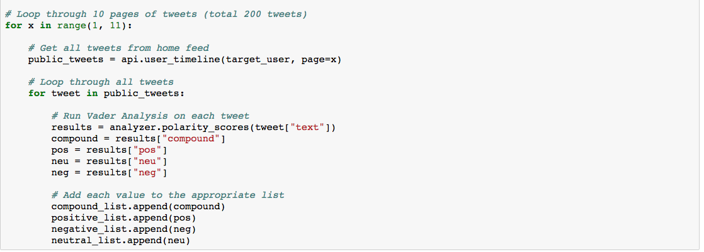
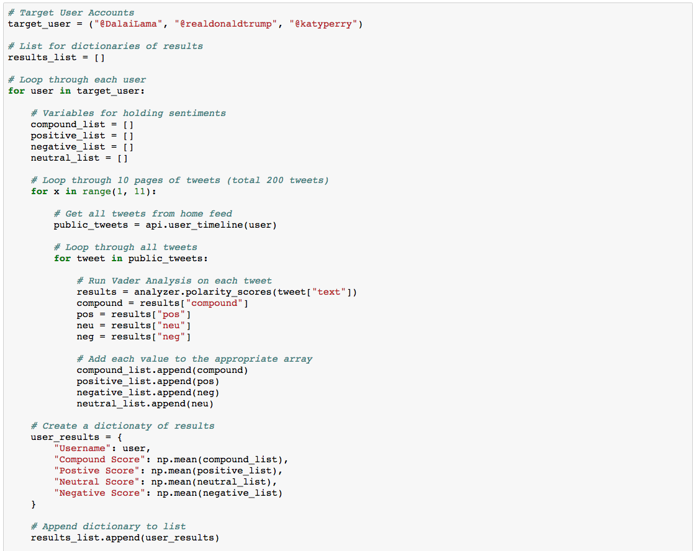
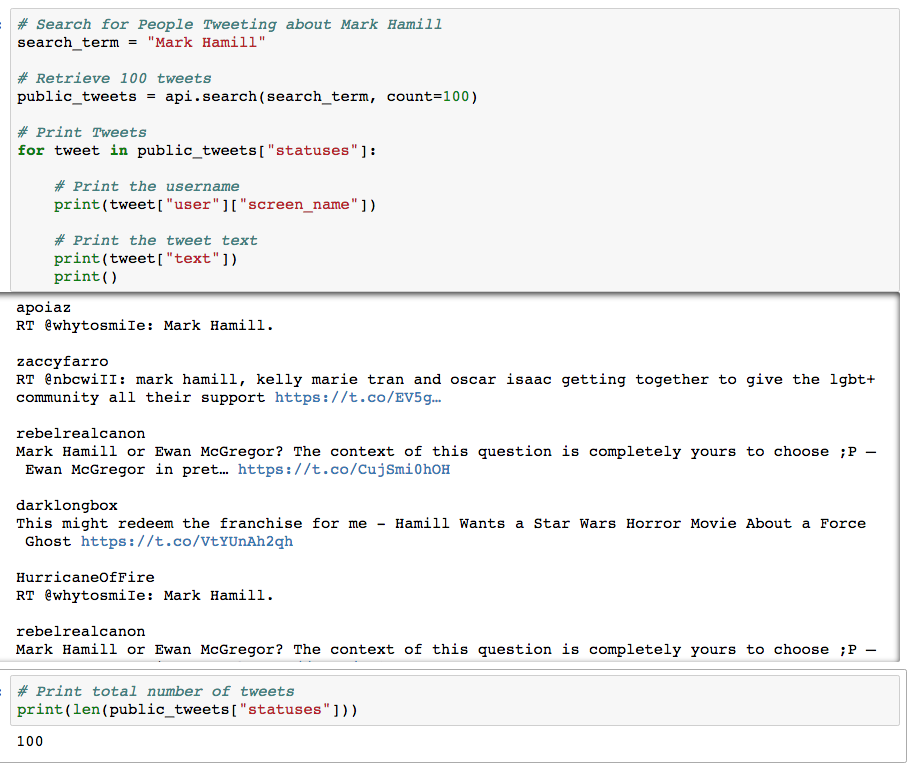
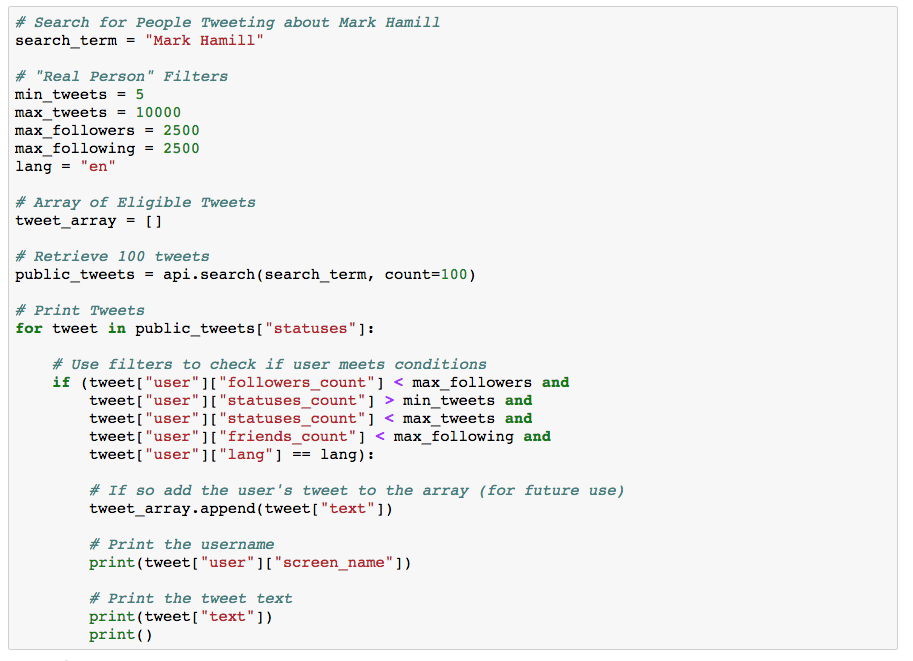
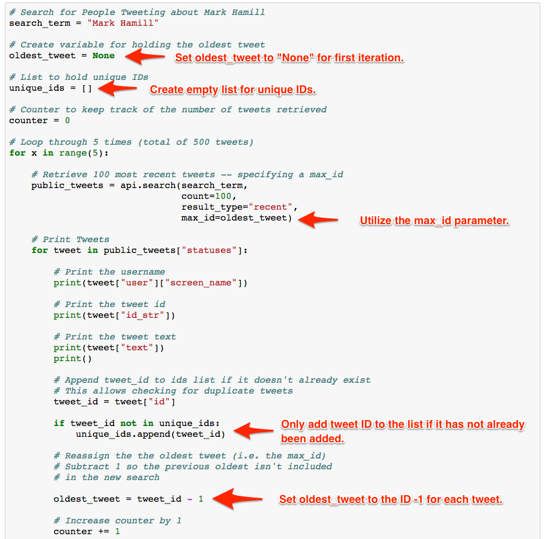
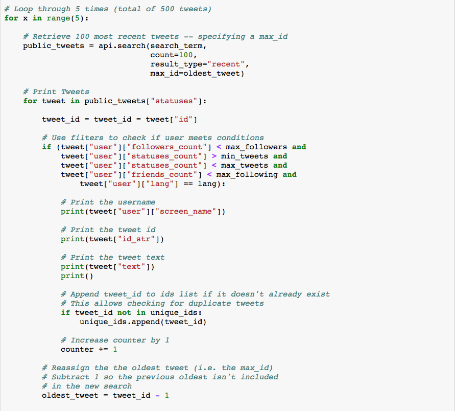
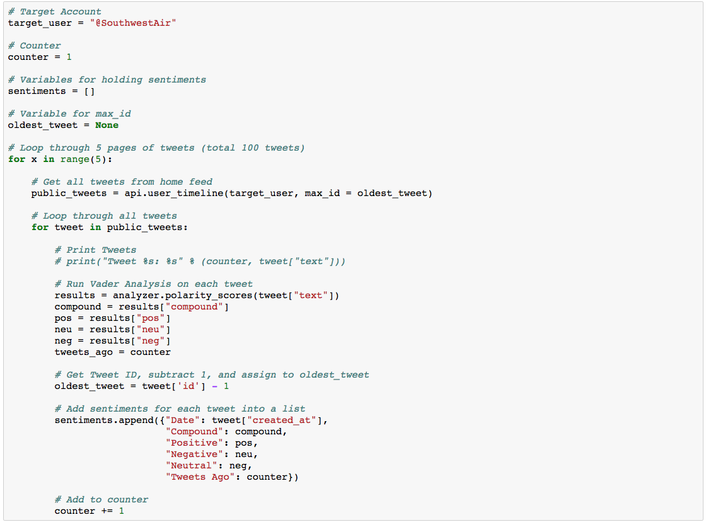
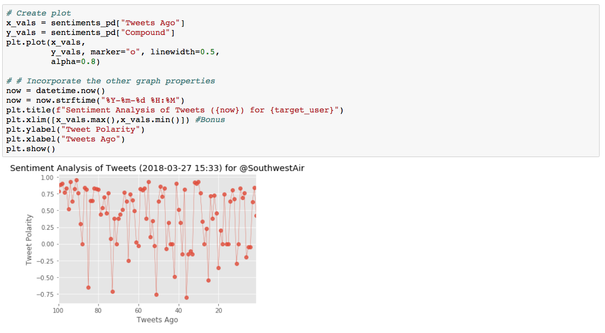

## 7.2 Lesson Plan - Posting Twitter Data

### Overview

In today's class, students will continue to explore Twitter by using the **V**alence **A**ware **D**ictionary and s**e**ntiment **Reasoner** (VADER) to perform **sentiment analysis** on tweets retrieved from the API. Students will also see how to **post tweets programmatically**.

##### Instructor Priorities

* Students will be able to use Tweepy to retrieve tweets.

* Students will be able to filter tweets based on certain criteria.

* Students will be able to perform sentiment analysis on text.

* Students will be able to use pagination when fetching tweets.

* Students will be able to use Python to tweet programmatically.

##### Instructor Notes

* Students will still use the Twitter account and api keys they have from the previous class. Alert them to keep them ready as being able to copy and paste them will save them from extra tedious work.

* Students may be confused at first about looping through and analyzing tweets but assure them they will start to see a pattern.

* Have your TAs refer to the [Time Tracker](TimeTracker.xlsx) to keep pace.

### Sample Class Video (Highly Recommended)

* To view an example class lecture visit (Note video may not reflect latest lesson plan): [Class Video](https://codingbootcamp.hosted.panopto.com/Panopto/Pages/Viewer.aspx?id=011a35eb-0a95-4ce6-aaeb-5f22f605d66e)

- - -

### 1.	Instructor Do: Welcome Students (0:05)

* Welcome the class. Today we will continue to dive into social media analysis with Python using [Tweepy](http://www.tweepy.org/).

### 2. Students Do: Get Tweets Review (0:15)

* Show the students the following output of [01-Stu_Review_Tweepy/Stu_Get_Relief.ipynb](Activities/01-Stu_Review_Tweepy/Solved/Stu_Get_Relief.ipynb)

* **File:** [01-Stu_Review_Tweepy/Stu_Get_Relief_Unsolved.ipynb](Activities/01-Stu_Review_Tweepy/Unsolved/Stu_Get_Relief.ipynb)

* **Instructions:** [01-Stu_Review_Tweepy/README.md](Activities/01-Stu_Review_Tweepy/README.md)

  * Loop through 5 pages of tweets (100 tweets total)

  * Print out each tweet with a number keeping track the number of tweets.  For example, the most recent tweet should read "Tweet 1: <Text of the most recent tweet>".

  * **Hints:**

    * Use a nested for loop and a counter at the end of your loop to increment.

    * Refer to the [Tweepy Documentation](http://docs.tweepy.org/en/v3.5.0/api.html#timeline-methods)

### 3. Instructor Do: Review Warm up activity (0:05)

* Open [01-Stu_Review_Tweepy/Stu_Get_Relief.ipynb](Activities/01-Stu_Review_Tweepy/Solved/Stu_Get_Relief.ipynb) in Jupyter Notebook and run the code.

* Review the solved code.  Point out the nested loops and counter that we use to maintain state.

* Guide students through the use of the nested loop and the use of the counter.

  * Tweepy allows a user to page through 20 tweets at the time by adding a 'page' parameter to the `user_timeline` method.

  

* Answer any remaining questions before slacking out the solution and moving on.

### 4. Instructor Do: Vader Sentiment (0:10)

* **File:** [Activities/02-Ins_VADER_Analysis](Activities/02-Ins_VADER_Analysis/Solved/Ins_VADER_Analysis.ipynb)

* Introduce **V**alence **A**ware **D**ictionary and s**e**ntiment **Reasoner** ([VADER](https://github.com/cjhutto/vaderSentiment)).

  * Slack out the VADER [Github page](https://github.com/cjhutto/vaderSentiment).

* Instruct the class to `pip install vaderSentiment==2.5`.

* The best way to understand this library is to work through a few examples, so let's get to it.

* Open up [02-Ins_VADER_Analysis/Ins_VADER_Analysis.ipynb](Activities/02-Ins_VADER_Analysis/Solved/Ins_VADER_Analysis.ipynb) in Jupyter notebook and run the code for the students.

  

* Just by looking at the output, ask the students if they can take a guess at what our code is doing.

* Identify that running sentiment analysis on a piece of text produces a JSON result, for example `{'neg': 0.0, 'neu': 0.254, 'pos': 0.746, 'compound': 0.8316}`

* Explain that `compound` is the sum of the **valence scores** of each word in the input.

  * A valence score is a number indicating both _positivity_/_negativity_ and _intensity_.

  * The `pos`, `neu` and `neg` scores are ratios describing the proportion of the input text that falls into each category.

* Work through the `target_string` examples in the code by uncommenting the `sample_string` and changing the `target_string`.

  

* Feel free to take suggestions from the class and work through different examples.

* Answer any remaining questions before moving on.

### 5. Students Do: VADER Gutenberg Activity (0:10)

* In this activity, student with use the VADER Sentiment Analyzer to analyze 3 different sample texts.

  

* **Files**

  * [Stu_VADER_Gutenberg.ipynb](Activities/03-Stu_VADER_Gutenberg/Unsolved/Stu_VADER_Gutenberg.ipynb)

  * [Sample 1](Activities/03-Stu_VADER_Gutenberg/Resources/Sample1.txt)

  * [Sample 2](Activities/03-Stu_VADER_Gutenberg/Resources/Sample2.txt)

  * [Sample 3](Activities/03-Stu_VADER_Gutenberg/Resources/Sample3.txt)

* **Instructions:** [03-Stu_VADER_Gutenberg/README.md](Activities/03-Stu_VADER_Gutenberg/README.md)

  * Open and read the three sample texts.

  * For each sample, print out the sample text and the "compound", "positive", "neutral" and "negative" score for each.

* **Hints:**

  * Start with reading files and printing them. Once you have this, treat the files as if they were in your script the entire time. (What would be good to do this?)

### 6. Instructor Do: Review VADER Gutenberg (0:05)

* Open [03-Stu_VADER_Gutenberg/Stu_VADER_Gutenberg.ipynb](Activities/03-Stu_VADER_Gutenberg/Solved/Stu_VADER_Gutenberg.ipynb) in Jupyter Notebook and walk through the code with students.

* There is a decent amount of abstract functionality going on in our code which can be tricky to understand at first.

  * Import and initialize the sentiment analyzer.

  * Set variables to hold the text after reading them in.

  

  * Loop through each of the samples by creating a tuple holding each sample variable.

  * Run the VADER analysis on each sample, then parse and print the results.

  

* Answer any questions before moving on.

### 7. Students Do: Twitter VADER Analysis (0:10)

* In this activity, students will analyze the sentiment of tweets from the Dalai Lama.

  

* **File:** [Stu_VADER_Tweets.ipynb](Activities/04-Stu_VADER_Tweets/Unsolved/Stu_VADER_Tweets.ipynb)

* **Instructions:** [04-Stu_VADER_Tweets/README.md](Activities/04-Stu_VADER_Tweets/README.md)

  * Using the tweepy package, analyze the tweets from "@DalaiLama".

  * Analyze a total of 200 tweets. (How many tweets are on a page?)

  * Store the different scores (positive, negative, neutral, compound) in different lists.

  * Print the user's name and the mean of the following scores:

    * Compound

    * Positive

    * Neutral

    * Negative

* **Bonus:**

* Compare the analysis to two other twitter accounts.

* Feel free to use accounts of your own but remember you need to have at least 200 tweets.

* If you don't have an account or enough tweets, try using "@RealDonaldtrump" and "@Katyperry".

### 8. Instructor Do: Review Twitter VADER Analysis (0:05)

* Open [04-Stu_VADER_Tweets/Stu_VADER_Tweets.ipynb](Activities/04-Stu_VADER_Tweets/Solved/Stu_VADER_Tweets.ipynb) in Jupyter Notebook.

* There is a good amount of code in this file, so take time to check for understanding.

* The first section of the file is dedicated to our setup.

* Answer any questions regarding import statements and setting our authentication keys.

* Pay close attention to the Tweepy API Authentication section.

* Have students explain to you how the variables are being set, accessed, and passed into other methods.

  

* Review setting the `target_user` variable, as well as empty lists for each score.

* Have a student explain why we need empty lists and how they will be used.

  

* Explain first looping through the pages of tweets, then through the actual tweets on the page.  Highlight appending the scores to the lists in each loop.

  

* Explain that we use numpy to find the mean of each list and formatting to round the result to 3 decimal places.

  

* **Note:** Make sure to go over the bonus activity solution as the skills here will be used in a later activity.

* Open [04-Stu_VADER_Tweets/Stu_VADER_Tweets_Bonus.ipynb](Activities/04-Stu_VADER_Tweets/Solved/Stu_VADER_Tweets_Bonus.ipynb) and run the code.

* Explain that there are a few differences when dealing with multiple users and pandas DataFrames.

* First, store all of the users in a **tuple** or a **list**, and create an empty list to hold a dictionary for each user's results.

* The outer loop will loop through each user.  The first inner loop will loop through the pages, and the most inner loop will loop through the tweets.

* With each user, reset the score lists to empty lists.

* After looping through each page of tweets and appending the sentiment scores to a list, create a dictionary to hold to average scores and append then to `results_list`.

  

* Finally create a DataFrame of the results.

  

* **Note:** It really helps to put in breakpoints when working with nested loops, especially when you have three of them. If students are having a hard time grasping this concept, take the time to work through some nested loops, putting in breakpoints and helping them visualize.

### 9. Instructor Do: Filtering Tweets (0:10)

* Open [05-Ins_Filter_Real/Ins_Tweets_No_Filter.ipynb](Activities/05-Ins_Filter_Real/Solved/Ins_Tweets_No_Filter.ipynb), run the code, and note the number of results.

* The search method gives users the ability to search any term and returns all results whether or not they are from fake accounts, spam, or bots.

  

* Open [05-Ins_Filter_Real/Ins_Tweets_With_Filter.ipynb](Activities/05-Ins_Filter_Real/Solved/Ins_Tweets_With_Filter.ipynb).

* Use variables and conditional logic to distinguish real people from bots.

* Have a quick discussion about what other filters we could develop to better weed out spam.

  

### 10. Instructor Do: Pagination (0:10)

* Open [06-Ins_Search_Pagination/Ins_Search_Pagination.ipynb](Activities/06-Ins_Search_Pagination/Solved/Ins_Search_Pagination.ipynb) in Jupyter Notebook.

* Explain that we use pagination to grab large numbers of tweets.

  * More precisely, explain that we use pagination whenever we need more tweets than we can retrieve in a single response.

* Pagination with the search function is not as straight forward.  A `max_id` parameter set to the id of the last tweet on the previous page minus 1 allows users to retrieve another page of older tweets.

* Note that `oldest_tweet` is reassigned with each tweet.  Since the tweets are ordered newest to oldest, the id of the last tweet on the page is kept for the next iteration of the outer loop.

* Note that using `max_id` also works with the `user_timeline()` method used earlier.  This article provides a more in depth discussion of why the `max_id` parameter is preferred over using `page`: [Working with Timelines](https://developer.twitter.com/en/docs/tweets/timelines/guides/working-with-timelines)

* A counter and a list of unique ids allow us to confirm that we have successfully retrieved unique tweets using pagination.  Removing `- 1` from the `oldest_tweet` assignment will result in duplicate tweets.

  

* Explain that combing pagination and filtering allows for more flexibility with data analysis.

* Open [06-Ins_Search_Pagination/Ins_Search_Pagination_Filter.ipynb](Activities/06-Ins_Search_Pagination/Solved/Ins_Search_Pagination_Filter.ipynb) and run the code.

* This is similar to previous examples of filtering tweets as we are using "Real Person" filters.

* Explain the `if` statement that will apply filters to pull only tweets made by "real people".

* The `tweet_id` and `oldest_tweet` variables are assigned outside of the conditional because it is  most efficient to have `oldest_tweet` be the id of the the last tweet on the page regardless of whether or not it passes the filters.

  

* Take a moment to make sure students have a good understanding of pagination before going on break.

- - -

### 11. BREAK (0:15)

- - -

### 12. Students Do: Happy Airlines (0:10)

* Students will be working with many pages of airlines tweets. Explain that it is best to test their code only using a few pages of tweets before trying to pull 1000 tweets. This will help students to avoid hitting API rate limits.

* **File:** [Stu_Happy_Airlines.ipynb](Activities/07-Stu_Happy_Airlines/Unsolved/Stu_Happy_Airlines.ipynb)

* **Instructions:** [Activities/Unsolved/07-Stu_Happy_Airlines/README.md](Activities/07-Stu_Happy_Airlines/README.md)

* Your goal is to retrieve 1000 tweets for each of the 7 popular airlines and run a VADER sentiment analysis on them.

* Create an empty list to hold to results from each airline,

* Filter the tweets using the given "Real Person" filter variables.

* Create a "sentiment" dictionary for each airline that includes the search term, and the averages of the compound, neutral, positive, and negative scores.  Print this dictionary and append it to a list holding each airline's results.

* Create a DataFrame to display the results.

* **Hints:**

* Start with a subset of data for each airline while testing. Be sure that your code works with only one or two pages. Once you feel your code is correct, then, adapt your code to collect all 1000 tweets per airline.

* For a reference on using max_id, see this link: [Working with Timelines](https://developer.twitter.com/en/docs/tweets/timelines/guides/working-with-timelines)

### 13. Instructor Do: Review Airlines (0:05)

* Open [07-Stu_Happy_Airlines/Stu_Happy_Airlines.ipynb](Activities/07-Stu_Happy_Airlines/Solved/Stu_Happy_Airlines.ipynb) and go over the solution with students.

* Remind students that the goal of this exercise is to determine the the sentiment of the tweets about airlines.

* We can do this by saving our targets to a tuple or list, then looping over them.

  

* The rest of our code they have seen before for the most part.

* We loop through our pages, then loop through our tweets and analyze them.

* Since we are dealing with nested loops again, take the time to review how this works.  Detail which parts of the code are executing in which loop and why.

* Make sure to highlight the creating a dictionary to hold the average scores for each airline, appending the dictionary to a list, and using it to create a pandas DataFrame.

  
  

### 14. Students Do: Plot Sentiments (0:20)

* Explain that, in the next activity, students will begin plotting all the data we've acquired analyzing tweets.

* **File:**

  * [Stu_Plot_Sentiments.ipynb](Activities/08-Stu_Plot_Sentiments/Unsolved/Stu_Plot_Sentiments.ipynb)

* **Instructions:** [08-Stu_Plot_Sentiments/README.md](Activities/08-Stu_Plot_Sentiments/README.md)

* Run a sentiment analysis on tweets from "@SouthwestAir".

* On top of you regular analysis, you should also keep track of how many tweets ago was it tweeted.

* Next store our results into a pandas DataFrame and read results.

* Finally create a plot with the follow labels.

  * Title as "Sentiment Analysis of Tweet (`date`) for `Twitter Handle`.

  * Y label as "Tweet Polarity"

  * X label as "Tweets Ago"

* **Hints**:

* Make sure you are using the correct method from Tweepy to gather statuses from a specific user.

* **Bonus**:

  * Order the tweets from oldest to newest in the plot.

### 15. Instructor Do: Review Plot Sentiments (0:10)

* Open [08-Stu_Plot_Sentiments/Stu_Plot_Sentiments.ipynb](Activities/08-Stu_Plot_Sentiments/Solved/Stu_Plot_Sentiments.ipynb) and explain the code to students.

* First, a loop is used to run sentiment analysis on 5 pages of tweets, just as in previous examples.

* A counter is used to keep track of the order of the tweets.  Remember that the tweets are returned from newest to oldest.

  

* A DataFrame is created and the first 5 rows are displayed.

  

* Finally, we create a plot up using matplotlib or Pandas, and title the plot appropriately.

* For the bonus, `xlim` is used to change the ordering of the x-axis.

  

* Answer any remaining questions before slacking out the solution and moving on.

### 16. Instructor Do: Tweeting with Python (0:10)

* Before opening [09-Ins_Tweeting_Out/Ins_Tweet_Out.ipynb](Activities/09-Ins_Tweeting_Out/Solved/Ins_Tweet_Out.ipynb) in jupyter notebook update the [config.py](Activities/09-Ins_Tweeting_Out/Solved/config.py) file with you own API keys and access tokens.

  * The setup to send tweets is very similar to retrieving tweets.

  * Using the `.update_status()` method allows us to post to Twitter.

  * Run the code and open your twitter account to show students the result.

    

  * Feel free to run the code a few times with different messages.

* Next open [09-Ins_Tweeting_Out/Ins_Tweet_Out_With_Image.ipynb](Activities/09-Ins_Tweeting_Out/Solved/Ins_Tweet_Out_With_Image.ipynb).

  * Explain that `update_with_media()` allows user's to tweet with images.

  * A filepath and message is required.

  * Run the code, and then open your Twitter page to see the result.

    

### 17. Students Do: Hello Tweet (0:20)

* **File:** [Unsolved/10-Stu_Hello_Tweet/Stu_Hello_Tweet.ipynb](Activities/10-Stu_Hello_Tweet/Unsolved/Stu_Hello_Tweet.ipynb)

* **Instructions:** [Activities/10-Stu_Hello_Tweet/README.md](Activities/10-Stu_Hello_Tweet/README.md)

  * Update your twitter with two separate status updates.

  * Update your twitter with a photo and a witty comment to go with it.

  * Look up how to add friends by using "Friendship Methods". Programmatically add someone in class as your friend, and have them add you as a friend.

  * Once you are both twitter followers of each other you can then send direct messages to one another.  Give it a try!

  * Use the [tweepy docs](http://tweepy.readthedocs.io/en/v3.5.0/api.html) for reference

* **Bonus**

  * Retweet a tweet from someone else's account.

* **Double Bonus**

  * Delete some of your most recent tweets.

### 18. Instructor Do: Review Hello Tweet (0:05)

* Add your API keys and tokens to [config.py](Activities/10-Stu_Hello_Tweet/Solved/config.py).

* Open [10-Stu_Hello_Tweet/Stu_Hello_Tweet.ipynb](Activities/10-Stu_Hello_Tweet/Solved/Stu_Hello_Tweet.ipynb) in Jupyter Notebook and run the code.

* **Note** If you receive an error in your console when running the solved code, check the comments in [10-Stu_Hello_Tweet/Stu_Hello_Tweet.ipynb](Activities/10-Stu_Hello_Tweet/Solved/Stu_Hello_Tweet.ipynb). Twitter won't let you duplicate data in your tweets.

* Ask a students how they would update two separate statuses.

  * Explain that we can use `update_status()` two different times.

  

* Ask a student to explain how they'd update a tweet with image content.

  * Explain that we update statuses with media using `update_with_media()`.

  

* Open the [tweepy docs](http://tweepy.readthedocs.io/en/v3.5.0/api.html#API.create_friendship) and find the `create_friendship()` method.

  * **Note** Replace "@Plotbot5" with a student's screen name and have them add you before continuing.

  

* On the same page, scroll up a bit to the section on **Direct Message Methods**, find the `send_direct_message` method, and discuss how to send a direct message to someone.  Alternatively, open [Tweepy Docs - send_direct_message](http://tweepy.readthedocs.io/en/v3.5.0/api.html#API.send_direct_message)

  * Note that both users must follow each other to send direct messages to one another.

  

* The bonus uses both `user_timeline()` and `retweet()` to find a user tweet and retweet it.

  

* `destroy_status()` is used to delete a tweet.

  

* Take a moment to answer any remaining questions before slacking out the solution and dismissing class.

# LessonPlan & Slideshow Instructor Feedback

* Please click the link which best represents your overall feeling regarding today's class. It will link you to a form which allows you to submit additional (optional) feedback.

* [:heart_eyes: Great](https://www.surveygizmo.com/s3/4381674/DataViz-Instructor-Feedback?section=7.2&lp_useful=great)

* [:grinning: Like](https://www.surveygizmo.com/s3/4381674/DataViz-Instructor-Feedback?section=7.2&lp_useful=like)

* [:neutral_face: Neutral](https://www.surveygizmo.com/s3/4381674/DataViz-Instructor-Feedback?section=7.2&lp_useful=neutral)

* [:confounded: Dislike](https://www.surveygizmo.com/s3/4381674/DataViz-Instructor-Feedback?section=7.2&lp_useful=dislike)

* [:triumph: Not Great](https://www.surveygizmo.com/s3/4381674/DataViz-Instructor-Feedback?section=7.2&lp_useful=not%great)

- - -

### Copyright

Trilogy Education Services © 2017. All Rights Reserved.
